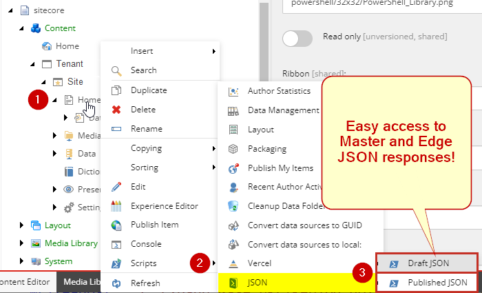

# xmcloud-json-view
Sitecore Powershell Extension **(SPE) module** for Menu Shortcut to see **Draft** and **Published JSON** headless content responses. Useful for developers building UI components or troubleshooting content issues.

# Version 2.0

Version 2 adds:

- Better JSON formatting, added line numbers.
- New diff feature
- Added Review ribbon buttons to mimic context menu

 

 

# JSON Layout Service Shortcuts:

Get a context menu option in Content Editor to quickly view the page layout service data.

 

Whichever option you pick it will show in this same format (below), whether from draft (Master database) or from the published content at Experience Edge.
 

This is great for a quick content check, or as a developer for grabbing the datasource model when typing component props.

---

# INSTALLATION

This tool can be added without code to any environment with these steps.

**Step 1**: Install the Sitecore Package.

Download the Sitecore Package from this repo (JSONViewer_SitecorePackage_2024-09-24.zip).

Install on your XM Cloud environments:

- Go to: https://xmapps.sitecorecloud.io/tools, the XM Cloud tools screen
- Click Utilities > **Control Panel**
- Click Administration > **Install a package**

Repeat for each desired environment.

This package adds the following Sitecore Powershell Context Menu Extensions and Function items:

 
**Step 2**: Enable Ribbon Buttons

  - Go to Sitecore Powershell ISE: https://{sitecore_CM_content-editor_host}/sitecore/shell/Applications/PowerShell/PowerShellIse
  - Click Settings -> Rebuild All... (down arrow) -> Sync Library with Content Editor Ribbon
  
    - (You may see errors from other items, ignore)
  - You should now see these extra Review ribbon buttons
  

**Step 3**: Configure Published Endpoint

Get your Live Context ID from the Environment Details screen:

https://deploy.sitecorecloud.io/

 
Then define the variable: **PublishedJSON_ContextID**

 
BTW, I searched the existing system ENV vars and Sitecore config, but didn’t see that value anywhere, so adding it manually was the next best thing.

**Step 4**: Redeploy XM Cloud App (to load new env var)
 
This will redeploy the current build to apply the new variable.

The shortcut is now ready to use. Give it a try! It will only appear for items having page layout.

 
 
 
 
 
 
 
 
 

---

# Related Tip

I added the Query and Variables as part of the output for jumping to a GraphQL playground. Tip: choose a Launch IDE link in Sitecore’s Deploy App (below) which will give you the header credentials. Then Copy and Paste the query and variables over.
 

